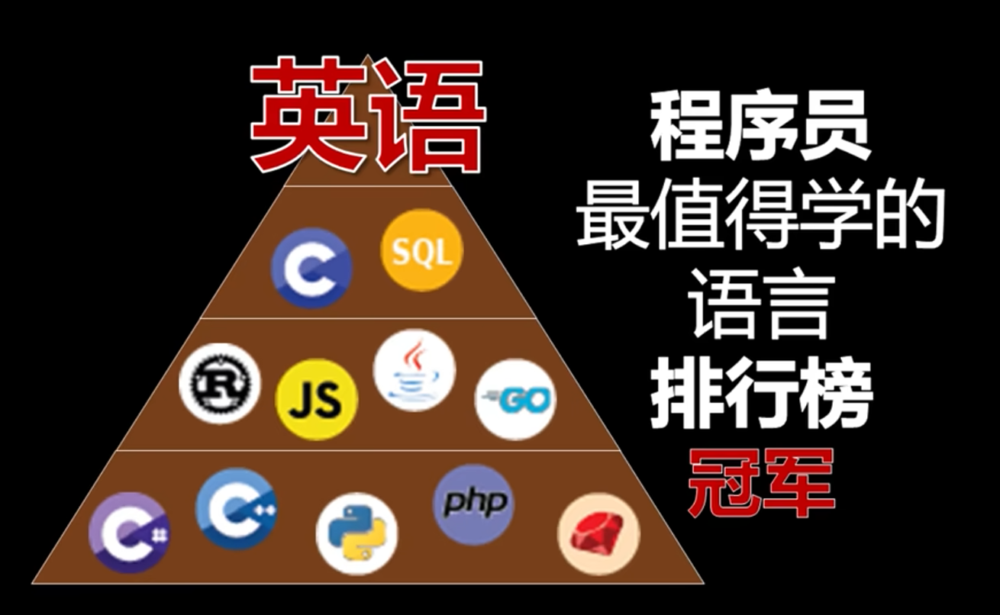
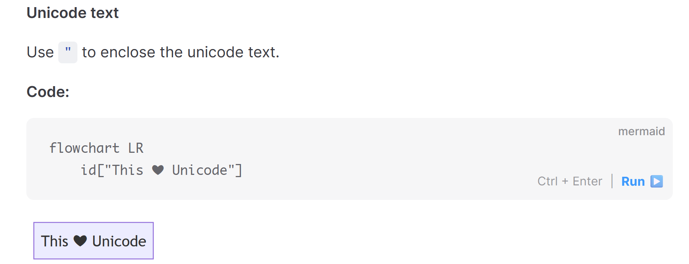
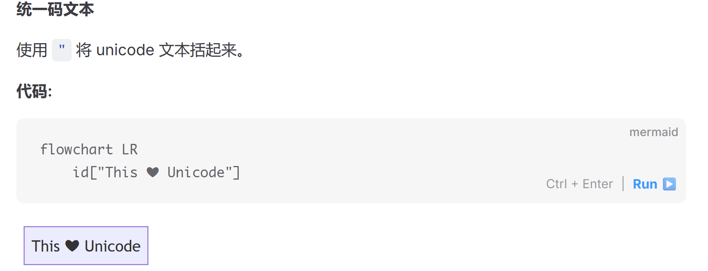

# 第一章 认识C语言
导入：你眼中的计算机
导入：你道听途说的计算机最重要的语言是什么？
答案：英语




中文翻译的问题

## 认识计算机
计算机：用二进制表示数据和指令，用二进制计算的机器。实际上是一堆门电路。

### 计算机是小学生
启动一个程序：把程序从硬盘复制到内存，从内存复制到CPU里面的寄存器，在寄存器里面运算，返回的结果存到内存，内存的结果再存回硬盘。
做除法运算：计算7除以2，一个非常简单的运算，计算机需要16步完成，用的算法是我们小学的长除法。一般我们用计算机做大整数运算，你猜需要多少步？
计算机的文化程度不高，就像一个小学生。没什么文化，但是干活特别勤快。
## 什么是编程
因此，我们想要让计算机高效运作，需要：给出明确具体的、详细划分的一步一步的、小学生也能完成的指令。就像洗碗，计算机没洗过碗，我们需要告诉它：
1. 把碗收拾起来，放到水槽
2. 用水盆接水
3. 放洗洁精
4. 对于每个碗，用百洁布清洁附着的油渍
5. 洗过的碗放到另一边
6. 所有碗都洗过之后，用水冲干净碗上附着的洗洁精
这就是编程的本质。
在没有C语言的时代，科学家用汇编语言，甚至是用二进制代码做这些事；在今天，程序员用算法、数据结构和面向对象的语言做这些事；在未来，程序员告诉AI这些步骤，让AI写代码。

# 两种学习方法
## 自底向上
老师讲课用的方法，学习C语言，把变量是什么、有哪些变量、变量和变量的差别、使用变量的注意事项全部讲一遍。
优点是像百科全书，详细、扎实，缺点是上完一个学期的课程才能学会写出程序，往往到了期中才学到函数、分支条件。

## 自顶向下
我们教授C语言用的方法。需要用到什么，就简单地讲解一下概念。目标是写出我们要完成的程序。

# 上课内容
## 第一个C语言程序
```c
#include<stdio.h>

int main(void)
{
	printf("Hello World!\nHello!"); 
	// print formatted，格式化打印
	return 0;
}
```
这是构成一个C语言程序的全部要素，请大家把这个程序敲到自己的电脑上。
我们定义了一个main，也就是主函数。C语言每次执行都会寻找这个函数，从这个函数开始执行。
然后，我们的主函数执行第一条语句，printf，也就是右边写的格式化打印，打印了Hello World！Hello！和一个\\n，这个\\n是做什么的呢？有同学可以告诉我吗？
## 什么是格式化
```c
#include<stdio.h>

int main(void)
{
	char name[] = "Association of Big Data";
	printf("Hello %s!\n", name); 
	// print formatted，格式化打印
	return 0;
}
```
大家把代码改写成这样，这个name这里写上自己的名字，看看会发生什么？
所谓的格式化，就是把%s,\\n这样的约定好的符号转换成它们的特定含义。因此，在C语言中，\\n就是换行的意思，%s就是字符串的占位符，会被替换成真正的字符串内容。
## 除了printf还有什么？
```c
#include<stdio.h> 
// <standard input output>.head
int main(void)
{
	puts("Hello World!"); 
	printf("Hello World!"); 
	return 0;
}
```
我们还有puts()函数可以打印。这个函数没有formatted，所以他不会按照格式来输出。
大家运行这个程序，观察一下puts有什么特别之处？
没错，它会自动换行。
## 多出来的东西是什么？
细心的同学应该会发现，所有的上面的程序里面，都有#include和一个return 0，这两行代码是做什么的？
还记得我们上课之前讲的内容吗？在计算机里，一切都是用二进制存储的，在我们看来，这是main函数、这是puts函数、这是printf、这是return 0，但是在计算机看来，这就是一串0和1，没有main，也没有return。
所以，我们需要一套编码，来告诉计算机，哪些是指令，哪些是数据。
而#include就是包含了这样的内容，<stdio.h>是一个标准输入输出库，在这个库里面包含了对printf、puts函数的定义和实现。没错，就像我们的main函数一样，puts函数里面也是想这样的函数。
大家按住ctrl键，单击printf函数就可以跳转到stdio.h里面printf的定义。可以看到，它也像我们的main函数那样，有非常多的和复杂的定义。
所以，没有#include这个语句，计算机就根本不知道printf是一个函数。同样，我们需要用一些数学的函数，就可以#include<math.h>，或者自己定义了一套函数，也是同样可以这样使用的。
```c
#include<stdio.h> 
// <standard input output>.head
#include<math.h>
#include "自己的函数.h"

int main(void)
{
	puts("Hello World!"); 
	printf("Hello World!"); 
	return 0;
}
```
而我们的return 0，则是在整个main函数结束后，返回0这个值。0表示程序正常完整地执行了，如果主函数运行一半就中断了，就不会返回0，没有返回0，就会告诉我们的操作系统，程序出问题了，没有完整运行。我们就可以根据这些信息调试。

# Coding Time
好，这就是我们今天要讲的C语言第一课的内容。接下来是我们的Coding Time，编程时间。接下来我们需要动手编程完成一些练习题。每一道题，我们都会邀请一位同学上来编程。
我希望大家都要自己动手去写代码，只有这样我们才能真正学会编程。光听理论是绝对不行的。
上来写代码的同学也不用紧张，我们并不需要你会写这道题，我们只是需要反馈，看看我们刚刚讲的一大堆理论有没有真正达到效果，有没有真正教会所有人。
在Coding的过程中，有任何问题都一定要提出来。可以举手示意，我就会过去。

## 用C语言输出金字塔
```
   *
  ***
 *****
*******
1. 用什么函数？puts()或者printf()
2. 能不能用一条语句完成呢？
```
```c
#include<stdio.h>

int main(void)
{
	puts("   *");
	puts("  ***");
	puts(" *****");
	puts("*******");
	printf(
	"   *\n"
	"  ***\n"
	" *****\n"
	"*******\n"
	);
	return 0;
}
```